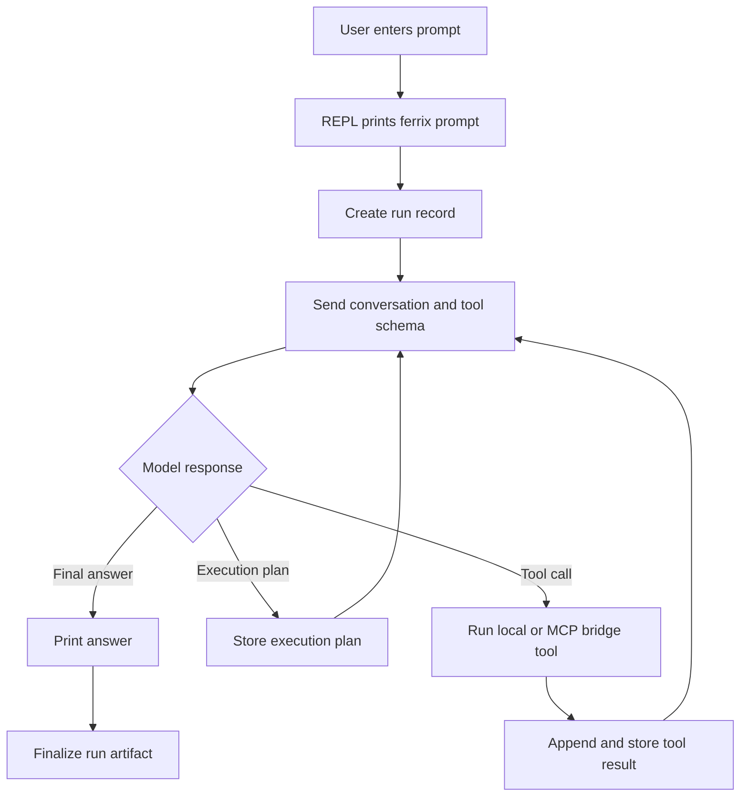

# Ferrix

Ferrix is a small Rust coding-agent CLI. It runs an interactive prompt, sends each user turn to an OpenAI-compatible Responses API, and lets the model call local tools for reading, writing, editing, and running shell commands.

```text
ferrix> _
```

## Setup

Ferrix reads non-secret model settings from `.ferrix/config.json` in the workspace:

```json
{
  "model": {
    "provider": "openrouter",
    "name": "openai/gpt-5.2",
    "reasoning_effort": "low",
    "max_output_tokens": 9000,
    "temperature": 0.2,
    "top_p": 0.9,
    "openrouter": {
      "referer": "https://example.com",
      "title": "Ferrix",
      "categories": "cli-agent"
    }
  }
}
```

API keys stay in environment variables. Use the key for the provider selected by the workspace config:

```sh
export OPENROUTER_API_KEY="..."
# or
export OPENAI_API_KEY="..."
```

If `.ferrix/config.json` is missing, Ferrix defaults to the OpenAI-compatible Responses API with model `gpt-5.5` and base URL `https://api.openai.com/v1`. When present, the file is validated with JSON Schema before Ferrix starts.

| Config key | Description |
| --- | --- |
| `model.provider` | Provider label. Use `openrouter` for OpenRouter. Defaults to `openai-compatible`. |
| `model.name` | Model name. Defaults to `gpt-5.5`. |
| `model.base_url` | Responses API base URL. Ferrix appends `/responses`; a full `/responses` endpoint is also accepted. OpenRouter defaults to `https://openrouter.ai/api/v1`. |
| `model.reasoning_effort` | Optional reasoning effort. Accepted values are `none`, `minimal`, `low`, `medium`, `high`, and `xhigh`. |
| `model.max_output_tokens` | Optional maximum output token count. |
| `model.temperature` | Optional sampling temperature from `0` to `2`. |
| `model.top_p` | Optional nucleus sampling value from `0` to `1`. |
| `model.openrouter.referer` | Optional OpenRouter `HTTP-Referer` attribution header. |
| `model.openrouter.title` | Optional OpenRouter `X-OpenRouter-Title` attribution header. |
| `model.openrouter.categories` | Optional OpenRouter `X-OpenRouter-Categories` attribution header. |

| Environment variable | Description |
| --- | --- |
| `OPENROUTER_API_KEY` | API key used when `model.provider` is `openrouter`. |
| `OPENAI_API_KEY` | API key used for OpenAI-compatible requests that are not OpenRouter. |
| `FERRIX_MODEL_PROVIDER` | Overrides `model.provider`. |
| `FERRIX_MODEL` | Overrides `model.name`. |
| `FERRIX_BASE_URL` | Overrides `model.base_url`. |
| `FERRIX_REASONING_EFFORT` | Overrides `model.reasoning_effort`. |
| `FERRIX_MAX_OUTPUT_TOKENS` | Overrides `model.max_output_tokens`. |
| `FERRIX_TEMPERATURE` | Overrides `model.temperature`. |
| `FERRIX_TOP_P` | Overrides `model.top_p`. |
| `FERRIX_OPENROUTER_REFERER` | Overrides `model.openrouter.referer`. |
| `FERRIX_OPENROUTER_TITLE` | Overrides `model.openrouter.title`. |
| `FERRIX_OPENROUTER_CATEGORIES` | Overrides `model.openrouter.categories`. |

## Usage

Run the CLI from the workspace you want the agent to operate on:

```sh
cargo run
```

Then enter a request at the prompt. Use `exit`, `quit`, or EOF to leave the session.

The agent can use these local tools:

- `read`: read a UTF-8 text file.
- `write`: write full contents to a file.
- `edit`: replace one exact text match in a file.
- `bash`: run a shell command and stream output to the terminal.
- `tool_search`: search tools exposed by configured MCP servers.
- `mcp_call`: call an MCP tool found with `tool_search`.

## MCP Servers

Ferrix can connect to stdio MCP servers using [`rmcp`](https://crates.io/crates/rmcp). Configure servers in `.ferrix/mcp.json` at the workspace root:

```json
{
  "servers": [
    {
      "name": "git",
      "command": "uvx",
      "args": ["mcp-server-git"],
      "env": {},
      "cwd": null,
      "disabled": false
    }
  ]
}
```

Ferrix loads this file at startup. If it is missing, Ferrix runs with only the built-in local tools. Each enabled server is started as a child process, initialized over stdio, and queried for its tools.

MCP tools are exposed through two built-in bridge tools:

- `tool_search` searches MCP server names, tool names, titles, and descriptions. Results include the server name, tool name, qualified name, description, and input schema.
- `mcp_call` invokes a selected MCP tool with `{ "server": "...", "tool": "...", "arguments": "{\"key\":\"value\"}" }`.

Use `tool_search` first to inspect the input schema, then call the selected tool with `mcp_call`. MCP tool calls and results are recorded in `.ferrix/runs/` alongside local tool activity.

## Agent Loop



## Logs And Run Artifacts

Internal diagnostics use `tracing` and can be enabled with:

```sh
export FERRIX_LOG=debug
```

Each agent turn writes JSONL run artifacts under `.ferrix/runs/`. These records include model metadata, execution-plan payloads when provided by the model API, tool calls, tool results, and final answers. The `.ferrix/` directory is ignored by git.

## Development

```sh
cargo fmt
cargo test
```

### Dev Container

This repo includes a VS Code/Cursor devcontainer for working inside Docker. Reopen the project in the container, then run:

```sh
cargo run
```

The container uses the official Rust devcontainer image, bootstraps `mise`, installs the tools declared in `mise.toml`, fetches Cargo dependencies, and passes through local `FERRIX_*`, `OPENAI_API_KEY`, `OPENROUTER_API_KEY`, and Rust logging environment variables. It also binds Docker Desktop's host SSH agent socket at `/agent.sock` so 1Password SSH keys can be used for GitHub clones and SSH commit signing. Check it from inside the container with:

```sh
ssh-add -l
```

The devcontainer also downloads the [Buildkite MCP server](https://github.com/buildkite/buildkite-mcp-server) `v1.6.1` Linux release into `~/.local/bin/buildkite-mcp-server` and passes through `BUILDKITE_API_TOKEN`. To test it with Ferrix, create `.ferrix/mcp.json`:

```json
{
  "servers": [
    {
      "name": "buildkite",
      "command": "buildkite-mcp-server",
      "args": ["stdio"],
      "env": {},
      "cwd": null,
      "disabled": false
    }
  ]
}
```

Set `BUILDKITE_API_TOKEN` on the host before reopening the devcontainer so it is passed through to the server.

# License

This application is released under Apache 2.0 license and is copyright [Mark Wolfe](https://www.wolfe.id.au).
