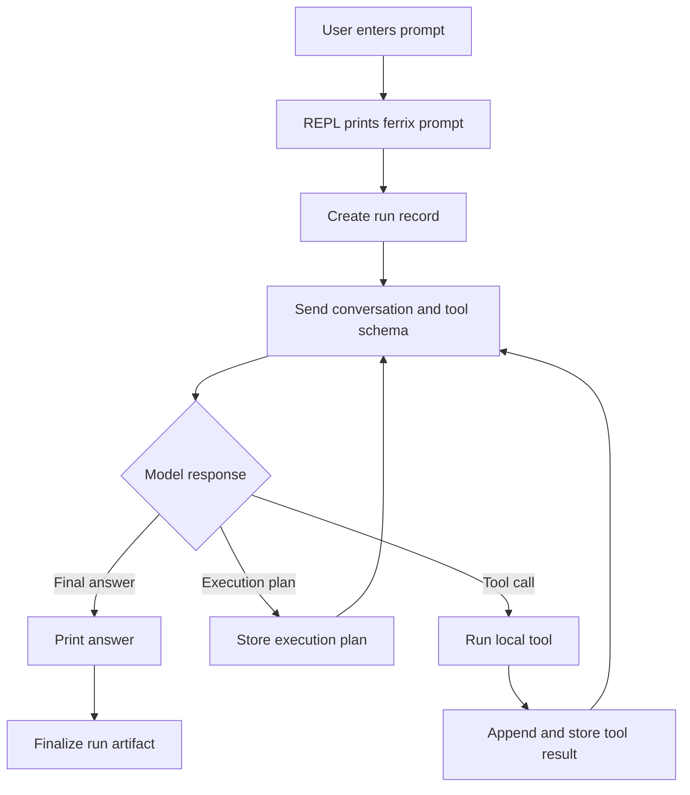

# Ferrix

Ferrix is a small Rust coding-agent CLI. It runs an interactive prompt, sends each user turn to an OpenAI-compatible Responses API, and lets the model call local tools for reading, writing, editing, and running shell commands.

```text
ferrix> _
```

## Setup

Ferrix is configured with environment variables:

```sh
export FERRIX_API_KEY="..."
export FERRIX_MODEL="gpt-5.5"
export FERRIX_REASONING_EFFORT="low"
export FERRIX_BASE_URL="https://api.openai.com/v1"
```

| Variable | Required | Description |
| --- | --- | --- |
| `FERRIX_API_KEY` | Yes | API key used for model requests. `OPENAI_API_KEY` is accepted as a fallback. |
| `FERRIX_MODEL` | No | Model name. Defaults to `gpt-5.5`. |
| `FERRIX_REASONING_EFFORT` | No | Optional reasoning effort for models that support it. Accepted values are `none`, `minimal`, `low`, `medium`, `high`, and `xhigh`. If unset, Ferrix uses the model default. |
| `FERRIX_BASE_URL` | No | Responses API base URL. Defaults to `https://api.openai.com/v1`. Ferrix appends `/responses`; a full `/responses` endpoint is also accepted. |
| `FERRIX_MODEL_PROVIDER` | No | Provider label recorded in run metadata. Defaults to `openai-compatible`. |

## Usage

Run the CLI from the workspace you want the agent to operate on:

```sh
cargo run
```

Then enter a request at the prompt. Use `exit`, `quit`, or EOF to leave the session.

The agent can use these local tools:

- `read`: read a UTF-8 text file.
- `write`: write full contents to a file.
- `edit`: replace one exact text match in a file.
- `bash`: run a shell command and stream output to the terminal.

## Agent Loop



## Logs And Run Artifacts

Internal diagnostics use `tracing` and can be enabled with:

```sh
export FERRIX_LOG=debug
```

Each agent turn writes JSONL run artifacts under `.ferrix/runs/`. These records include model metadata, execution-plan payloads when provided by the model API, tool calls, tool results, and final answers. The `.ferrix/` directory is ignored by git.

## Development

```sh
cargo fmt
cargo test
```

### Dev Container

This repo includes a VS Code/Cursor devcontainer for working inside Docker. Reopen the project in the container, then run:

```sh
cargo run
```

The container uses the official Rust devcontainer image, bootstraps `mise`, installs the tools declared in `mise.toml`, fetches Cargo dependencies, and passes through local `FERRIX_*`, `OPENAI_API_KEY`, and Rust logging environment variables. It also binds Docker Desktop's host SSH agent socket at `/agent.sock` so 1Password SSH keys can be used for GitHub clones and SSH commit signing. Check it from inside the container with:

```sh
ssh-add -l
```

# License

This application is released under Apache 2.0 license and is copyright [Mark Wolfe](https://www.wolfe.id.au).
